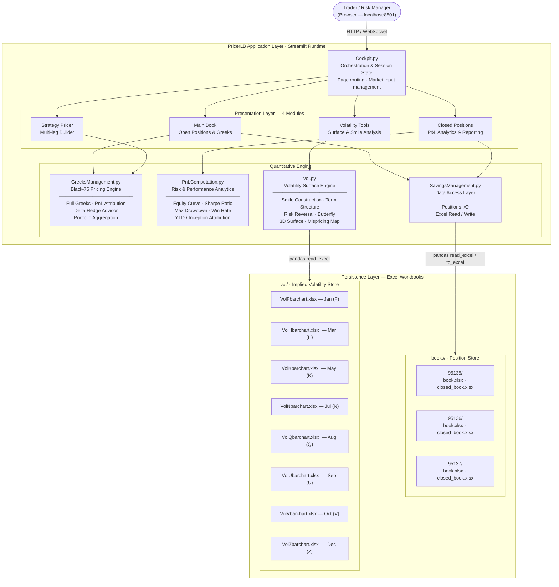
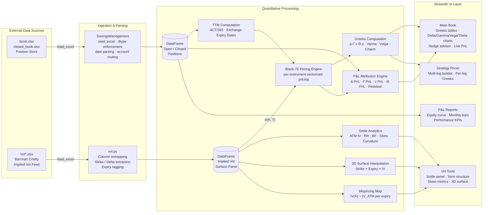
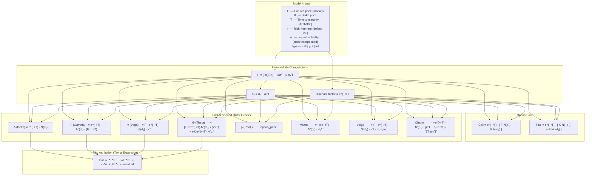
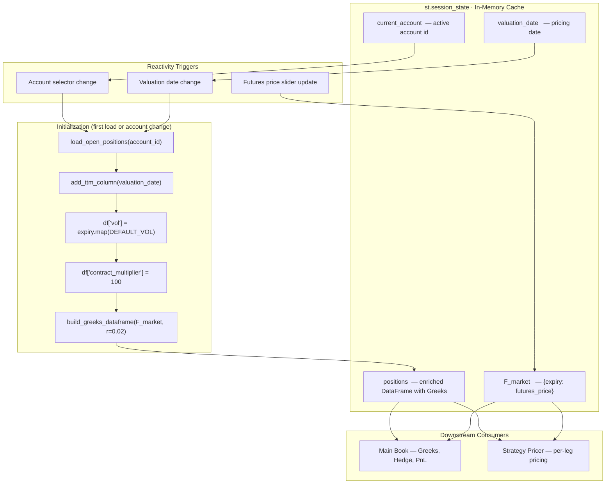
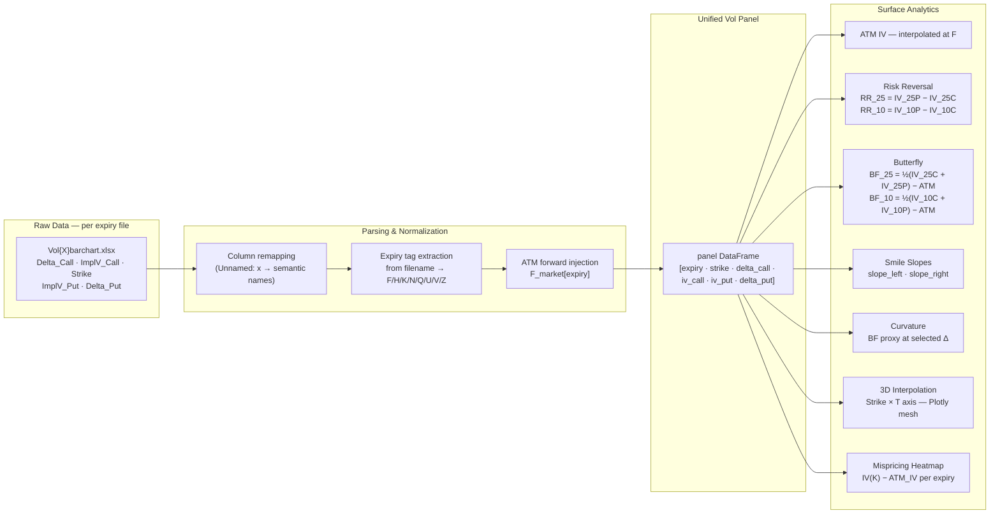
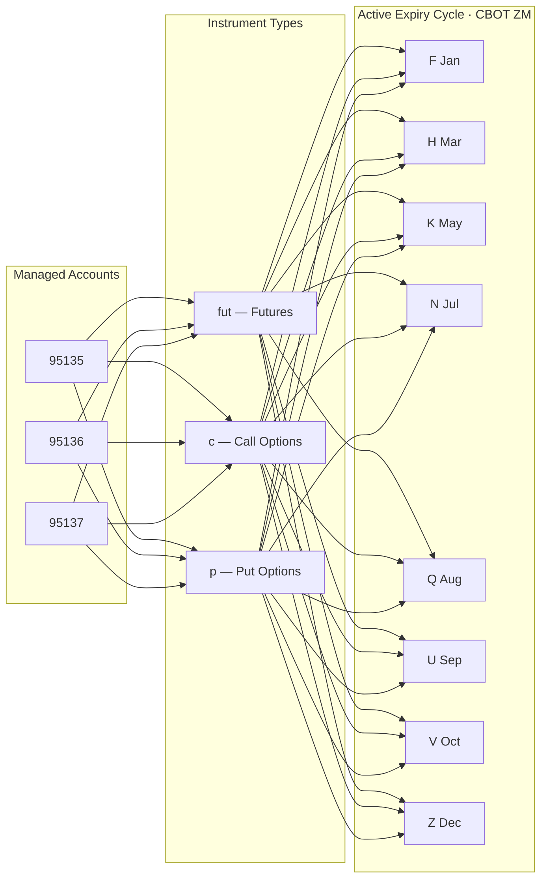

# System Architecture — PricerLB Soymeal
**Version:** 2.0 | **Asset Class:** Agricultural Commodities — Soybean Meal CBOT (ZM) | **Model:** Black-76

---

## 1. Executive Overview

PricerLB is a single-dealer risk management and pricing platform for CBOT Soybean Meal (ZM) options and futures. It provides real-time Greeks aggregation, P&L attribution, implied volatility surface construction, and a multi-leg strategy pricer — all within a unified, session-aware dashboard.

The system is organized around a **thin orchestration layer** (`Cockpit.py`) that delegates all quantitative logic to four specialized modules. Data persistence relies on Excel workbooks, enabling lightweight deployment with no database infrastructure.

---

## 2. High-Level System Architecture

---

## 3. Data Pipeline

---

## 4. Pricing Model — Black-76

---

## 5. Session State & Reactivity Model

---

## 6. Volatility Surface Construction

---

## 7. Contract & Expiry Reference

| Code | Month     | Termination Rule                               |
|------|-----------|------------------------------------------------|
| F    | January   | Business day prior to the 15th of the month   |
| H    | March     | Business day prior to the 15th of the month   |
| K    | May       | Business day prior to the 15th of the month   |
| N    | July      | Business day prior to the 15th of the month   |
| Q    | August    | Business day prior to the 15th of the month   |
| U    | September | Business day prior to the 15th of the month   |
| V    | October   | Business day prior to the 15th of the month   |
| Z    | December  | Business day prior to the 15th of the month   |

**Contract specs:** ZM · CBOT · 100 short tons · USD/short ton · Tick 0.10 · Tick value USD 10.00

---

## 8. Module Responsibility Matrix

| Module | Responsibility | Key Functions |
|---|---|---|
| `Cockpit.py` | Orchestration, routing, session state, UI layout | Page dispatch · `st.session_state` management · market input widgets |
| `GreeksManagement.py` | Black-76 pricing, Greeks, hedge advisor, PnL explain | `build_greeks_dataframe` · `portfolio_delta_by_expiry` · `compute_pnl_explain` · `delta_hedge_action_by_expiry` |
| `PnLComputation.py` | Realized P&L, performance metrics | `build_daily_pnl_series` · `compute_sharpe` · `compute_max_drawdown` · `compute_pnl_by_year` |
| `vol.py` | Vol surface construction, smile analytics | `build_smile_panel_from_excels` · `compute_skew_metrics` · `plot_vol_surface` · `compute_vol_mispricing_map` |
| `SavingsManagement.py` | Excel I/O, account-level data access | `load_open_positions` · `save_open_positions` · `load_closed_positions` |

---

## 9. Account & Portfolio Structure

---

## 10. Known Constraints & Design Decisions

| Area | Decision | Rationale |
|---|---|---|
| Persistence | Excel workbooks (no database) | Zero-infrastructure deployment · audit-friendly flat files |
| Pricing model | Black-76 with flat vol per expiry (default) | Industry standard for commodity options · smile loaded from Barchart when available |
| Vol interpolation | Linear interpolation across strikes within each expiry | Sufficient for risk monitoring · no arbitrage constraints not enforced |
| Session state | `st.session_state` as in-memory cache | Avoids recomputing Greeks on every widget interaction |
| Deployment | `streamlit run Cockpit.py` — single process | Internal single-user tool · no concurrency requirements |
| Vol source | Barchart Cmdty manual export (`.xlsx`) | No live API — vol data requires manual refresh |
| FX exposure | USD-denominated · FX P&L not yet computed | Planned feature — flagged in UI |

---

*Source: `Cockpit.py` · `GreeksManagement.py` · `PnLComputation.py` · `vol.py` · `SavingsManagement.py`*
